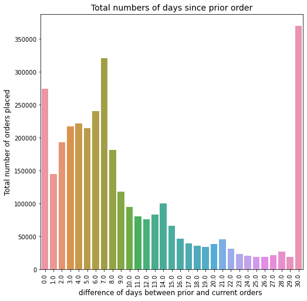

# instacart-market-basket-analysis
The goal of this competition was to predict grocery reorders: given a user’s purchase history (a set of orders, and the products purchased within each order), which of their previously purchased products will they repurchase in their next order?
The data that Instacart opened up include orders of 200,000 Instacart users with each user having between 4 and 100 orders. Instacart indicates each order in the data as prior, train or test. Prior orders describe the past behaviour of a user while train and test orders regard the future behaviour that we need to predict. As a result, we want to predict which previously purchased products (prior orders) will be in a user’s next order (train and test orders). For the train orders Instacart reveals the results (i.e. the ordered products) while for the test orders we do not have this piece of information. Moreover, the future order of each user can be either train or test meaning that each user will be either a train or a test user. The setting of the Instacart problem is described in the figure below.

Introduction
As per a Mckinsey report, 60%+ Europeans tried a new shopping experience during the pandemic, and most are expected to continue with new habits. The Instacart project gave me an opportunity to gain more insights into consumer buying behavior in the gig economy against the backdrop of current economic environment, apart from applying my newly learned data science skills. Moreover, being an Instacart customer myself, I was excited to see my real life experience being engineered as a feature!!

Business Problem
The business requirement here is to predict which previously purchased products will be in customer’s next order. Our aim here is to predict if a user will reorder previously purchased products, it does not involve suggesting new products to customers. The final aim is to drive higher sales for the company via improved customer experience, increased customer interaction and suggesting relevant products to consumers, which saves time. Net/net maximize their return on investment (ROI) based on the information gathered from customers' purchases and preferences. I must say making customers switch to online grocery shopping is not an easy proposition, while the pandemic provided tailwinds, the key for companies like Instacart is to retain existing customers and drawing news consumers to the platform 

Recommendation systems are now frequently used by online businesses. They use these systems to improve shopping potential and increase user interaction, allowing them to maximize their return on investment (ROI) based on the information gathered from customers' purchases and preferences. The knowledge-based recommender system used by Instacart is an essential tool for those purposes by individually presenting more relevant products to each user

What's in it for Instacart?
In my opinion this is Instacart's first attempt to develop a customized taste profile of its customers (though not explicitly stated). At the same time customer insights can also help retailers to advertise and sell their products in a better way on the platform.

Business Model
Instacart provides on-demand grocery delivery by connecting customers with personal shoppers, who purchase products from the retailer specified by the customer and deliver it to the doorstep within a stipulated time. Instacart does not own any grocery store, It provides a platform for grocery retailers to sell their products on the platform. Instacart earns from the delivery fees and placement fees from the companies. 

ML Formulation of the Problem
This problem is different from the classical recommendation problem (like Netflix recommendation system) as in classical recommendation problem, we generally recommend users, products (or movies) that are similar to the products that the users have already purchased( or viewed).
But in this problem, we have to recommend users the products, the user has already purchased. We are going to pose this problem as supervised learning binary classification problem. With binary labels being whether the previously ordered product will be reordered or not, we have to come up with features which summarizes the information about the user’s previous orders and the products contained in them.

0 - indicates that the user did not reorder
1 - indicates that the user reordered

Data Source
The data that Instacart opened up include orders of 200,000 Instacart users with each user having between 4 and 100 orders. Instacart indicates each order in the data as prior, train or test. Prior orders describe the past behaviour of a user while train and test orders regard the future behaviour that we need to predict. For the train orders Instacart reveals the results (i.e. the ordered products) while for the test orders we do not have this piece of information. Moreover, the future order of each user can be either train or test meaning that each user will be either a train or a test user.
We are provided with 6 corelated CSV files/tables, namely:
1) Orders: This table includes all orders, namely prior, train, and test. 
2) Order_products_train: This table includes training orders and indicates whether a product in an order is a reorder or not (through the reordered variable) 
3) Order_products_prior: This table includes prior orders. It indicates whether a product in an order is a reorder or not (through the reordered variable). 
4) Products: This table includes all products and their related information. 
5) Aisles: This table includes all aisles and their related information
6) Departments: This table includes all departments and their related information.

Other repository contents

Jupyter notebooks:

InstacartAnalysis_EDA: contains the code for data cleansing, EDA 
InstacartAnalysis_feature_engineering: contains the code for feature engineering
InstacartAnalysis_Models: contains the code for model training and evaluation

Exploratory Data Analysis

We can note there that the maximum number of reorders are for the standardized products, such such as produce, dairy egss, snacks, frozen. Conversly, items which are more personalized such as household, babies, personal care, alcohol tend to have less reorders. 

Add to cart order is negatively correlated with reordered. This implies, if add to cart order is lower then the probability of product being reordered is more. Order number is positively correlated with reordered. The higher the number of orders, probability of the order having products to be reordered is higher. Order number is negatively correlated with days since prior order. This implies, the more the gap between orders being placed less is the number of orders placed.

Feature Engineering

I created 4 types of features.
User Features: What is user like?
Product Features: What is the product like?
User x Product Features: How does an user feel about the product?

Creating features using user-ids and product-ids

To explain some top features:
uxp_order_rate: This is the total orders per product divided by total orders of the user
user_average_basket: count of a particular product ordered by an user/total number of orders
prod_reordered_ratio: the reordered ratio of each user and product combination
user_order_starts_at: At what number does the user's order number starts at ? This tells us if the user is an old customer or a new customer 
of instacart
reordered_ratio: users reordered ratio
mean_days_since_prior_order: average days between each order of users
std_cart_position: standard deviation of product's add to cart position
avg_cart_position: average of product's add to cart position
total_num_orders: total number of orders placed by the user
max_cart_position: maximum of product's add to cart position
avg_no_prds_each_purchase: Average number of products brought by user in each purchase

Modeling
I used logistic regression method because it comes a built-in method of handling imbalanced classes, which is using the class_weight parameter to weight the classes to make certain we have a balanced mix of each class 

this is binary classification probelm and I used the logistic regression method to predict the user reorders.The training data is imbalanced with 7,645,837 products with no-reorders and 828,824 products with reorders. Hence, in this case we have changed decision threshold

also, accuracy would not be the right measure to evaluate the model. We need to use the F1 score

Nevertheless, perhaps the simplest approach to handle a severe class imbalance is to change the decision threshold. Although simple and very effective, this technique is often overlooked by practitioners and research academics alike as was noted by Foster Provost in his 2000 article titled

Threshold selection: Models give probabilities of reordering. By default product with reorder probability above 0.5 is predicted as ‘1’ or reordered. We can set the different thresholds to get better accuracy with help of training data. I have a hyper-tuned threshold and 0.2 found to be the best threshold for all models.

Evaluation

Conclusion

Next steps:
Deep dive little more into feature engineering and try to create few more features
Apply XGboost algorithm on the dataset

